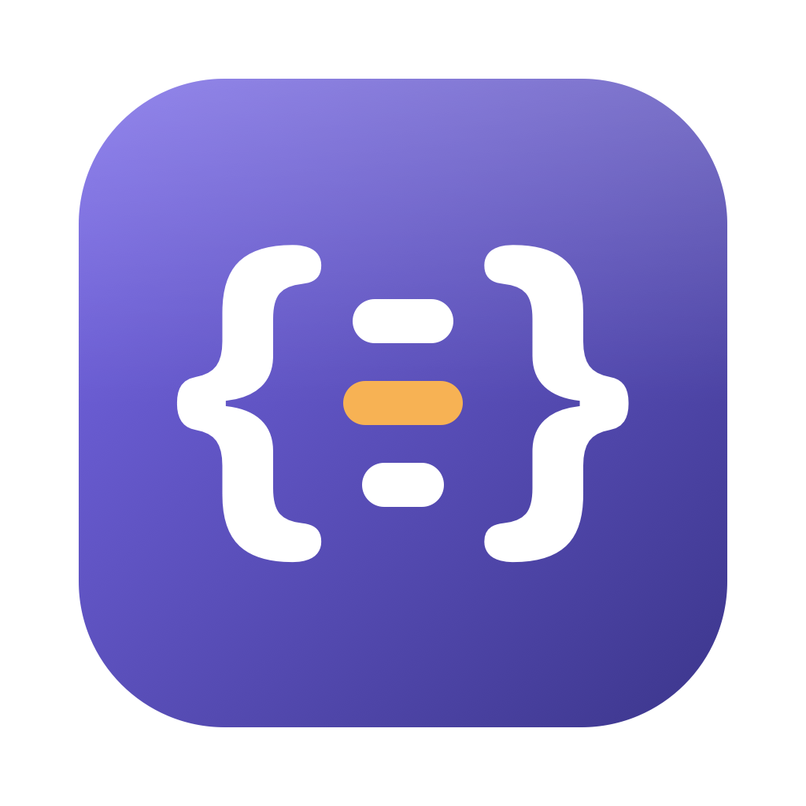
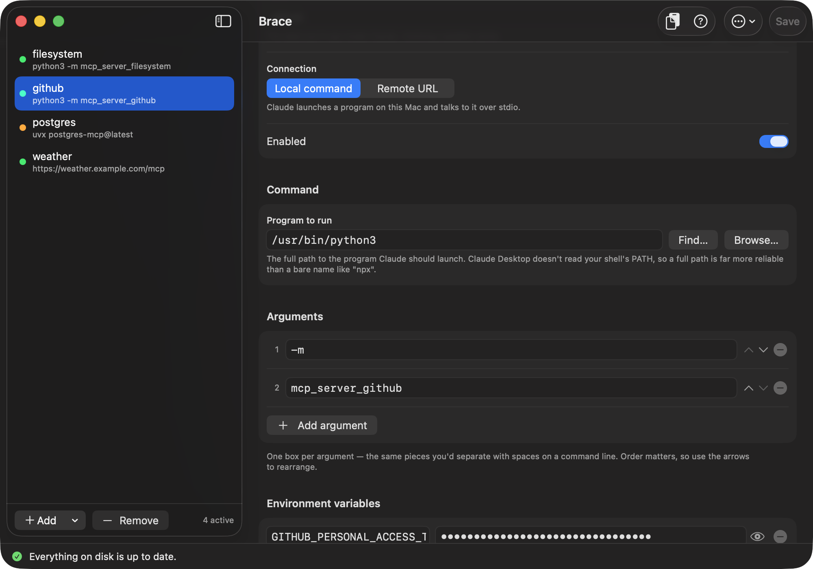
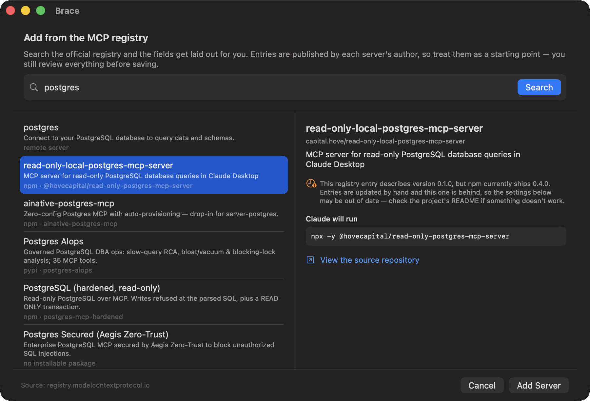
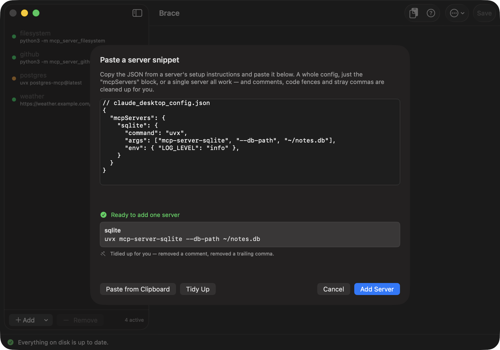
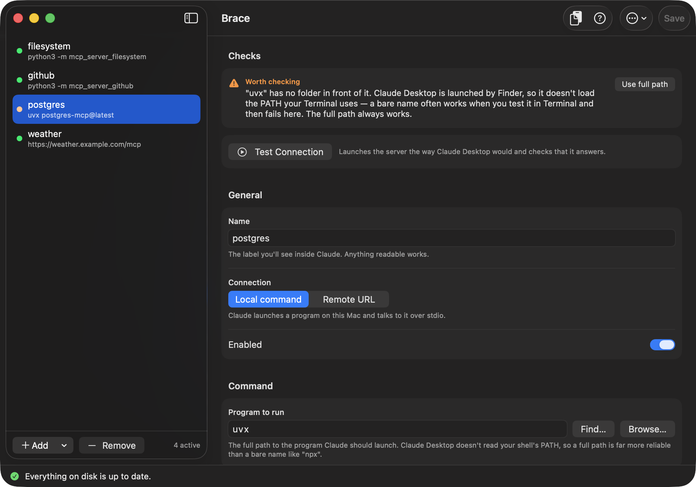

# Brace



**MCP Manager for Claude Desktop.** A native macOS app for managing your MCP
servers, so you never have to count brackets in `claude_desktop_config.json`
again.



This file is also the app's built-in guide: the app renders it directly, so there's
only one copy to keep current. Open it from the **?** button in the toolbar, from
**Help → Brace Help**, or with **⌘?**. `CHANGELOG.md` appears there
too, under **Release Notes** — and `build.sh` reads the app's version number out of
its newest heading, so releasing means editing one file.

## Build and run

Needs **macOS 14 or later** and the Xcode Command Line Tools
(`xcode-select --install`). No Xcode, no Node, no package manager, no network
access.

```bash
./build.sh --install
```

That builds `Brace.app` and copies it into `/Applications`. Drop the
`--install` to leave it in `./build` instead.

## What it does

**Add servers from the registry.** **+ → Add from Registry…** searches the official
MCP registry — over a thousand published servers — and lays the fields out for you:
the launcher resolved to a full path, the package arguments in order, and a row for
every setting the server needs, each with its description and marked required or
secret. You review it and save; nothing is written until you do.

Two things it is careful about. Registry entries are **written by hand by each
server's author**, not generated from the code, so they go stale — the app checks
what PyPI or npm actually ships and warns you when the entry is behind. And secret
values are never filled in, only named and masked, so you enter them yourself.



**Add servers by pasting.** Most MCP servers document themselves as a block of
JSON in a README. Click **Paste JSON** — the box fills itself from your clipboard
if a snippet is already there — and the app merges it into your config. It accepts
a whole config file, just the `"mcpServers"` block, or a single server body.

What people copy is rarely strict JSON, so the box cleans it up rather than
complaining, and tells you what it changed:

- `// claude_desktop_config.json` header comments, and `/* … */` blocks
- ```` ```json ```` markdown code fences
- curly quotes picked up from a web page
- trailing commas after the last entry
- unquoted keys and single-quoted strings from JavaScript-style snippets
- surrounding prose like "Add this to your config:"



**Tidy Up** rewrites the box as clean, formatted JSON so you can see what it read.
Genuinely broken input still gets an error with the exact line and column — and
things that only *look* like problems are left alone, so a `//` inside a URL and an
apostrophe inside a comment both survive untouched.

**Edit servers in a form.** Name, command, arguments (one numbered box each, with
arrows to reorder), and environment variables (key/value rows, with secret-looking
values masked until you click the eye). Remote HTTP/SSE servers get a URL and
headers instead. Every server has a **Show the JSON this produces** disclosure, so
you can see what gets written without ever typing it.

**Turn servers off without deleting them.** The switch lifts a server out of
`claude_desktop_config.json` into a sidecar file, so Claude stops loading it while
the full definition — env vars included — waits intact for you to switch it back on.

**Test a server before trusting it.** **Test Connection** launches it exactly the
way Claude Desktop would — same sparse environment — and completes an MCP handshake,
then reports which of three things happened: it wouldn't start (your config is
wrong, here's the output), it started and answered (you're good, here's what it
calls itself and how many tools it offers), or it answered but reported trouble
reaching something downstream. That last case is shown as information rather than
an error, because a perfectly configured server still can't reach a controller
you're not on the network with.

**Catch the mistakes that actually bite.** A dot in the sidebar shows each server's
state — green is fine, amber is worth checking, red is broken, grey is disabled —
and selecting the server puts the reason at the top of the panel, in full, with a
button to fix it. What it flags:

- A bare command like `npx` or `uvx`. Claude Desktop is launched by Finder, so it
  never sees the `PATH` your shell profile builds — a bare name that works in
  Terminal often fails in Claude. One click on **Use full path** resolves it.
- Several copies of the same command. If `uvx` exists in Homebrew *and* `~/.local/bin`,
  **Choose…** lists them all with their version and where each came from, so you
  pick the one you want rather than guessing which Claude would find.
- A leading `~`, which this config file does not expand.
- A command that doesn't exist or isn't executable.
- Duplicate server names, which would silently drop a server.
- Empty or duplicated environment variables, and malformed URLs.



**Find…** next to the command field opens that same list any time, so you can switch
between installed versions without an error having to appear first.

**Restart Claude Desktop** from the ••• menu. Claude reads this config once at
launch, so changes don't take effect until it restarts — the app offers to do it
right after you save.

## How it protects your config

Your config file holds more than MCP servers — `preferences` and
`coworkUserFilesPath` live there too, and Claude Desktop rewrites them on its own.
So the app is deliberately conservative:

- **It only ever rewrites the `mcpServers` key.** Everything else is parsed and
  written back byte-for-byte, in its original order.
- **Keys it doesn't recognize are preserved**, both at the top level and inside a
  server, so a field a future Claude Desktop version adds is never dropped.
- **A timestamped backup** goes into `MCP Manager Backups/` before every save.
  **Manage Backups…** in the ••• menu lists them with their date, size and which
  servers each one holds, marks the one matching your current config, and lets you
  restore, delete individually, or delete the lot. Retention is yours to set —
  the last 10, 25, 50, or keep everything.
- **Writes are atomic**, so an interrupted save can't leave Claude with half a file.
- **A config that's already broken is never overwritten.** The app reports the line
  and column of the syntax error and stops.

## What it talks to

The app is offline apart from two things you can see:

| Host | For |
| --- | --- |
| `registry.modelcontextprotocol.io` | Searching published servers |
| `pypi.org` / `registry.npmjs.org` | Checking what version actually ships |
| `api.github.com` | Asking once a day whether there's a newer release |

Nothing is sent but the search term, and nothing is downloaded or executed. The
registry fills in form fields for you to review; the update check tells you a
version exists and shows its notes, then points you at the download page.
A failed update check is silent.

## Files it touches

| Path (under `~/Library/Application Support/Claude/`) | Role |
| --- | --- |
| `claude_desktop_config.json` | Your real config. Only `mcpServers` is rewritten. |
| `mcp-manager-disabled.json` | Servers you switched off. Claude Desktop never reads this. |
| `MCP Manager Backups/` | Timestamped copies from before each save. |

## Source layout

| File | Role |
| --- | --- |
| `Sources/JSONValue.swift` | Order-preserving JSON parser and serializer. |
| `Sources/JSONLenient.swift` | Cleans up pasted snippets (comments, fences, stray commas). |
| `Sources/CommandResolver.swift` | Finds every copy of a command, with versions. |
| `Sources/RegistryClient.swift` | Talks to the MCP registry and maps entries to servers. |
| `Sources/ServerTester.swift` | Launches a server and completes an MCP handshake. |
| `Sources/UpdateChecker.swift` | Asks GitHub whether there's a newer release. |
| `Sources/AboutView.swift` | The About window and release-notes sheet. |
| `Sources/MCPServer.swift` | The server model and its JSON mapping. |
| `Sources/ConfigStore.swift` | Loading, saving, backups, import, disable sidecar. |
| `Sources/Validation.swift` | The checks behind the sidebar dots. |
| `Sources/ContentView.swift` | Sidebar, toolbar, status bar. |
| `Sources/ServerDetailView.swift` | The editing form. |
| `Sources/ImportSheet.swift` | Paste-a-snippet import. |
| `Sources/BackupsSheet.swift` | The backup manager. |
| `Sources/RegistrySheet.swift` | Searching and previewing registry entries. |
| `Sources/TestSheet.swift` | Reporting what a test found. |
| `Sources/CommandPickerSheet.swift` | Picking between installed versions of a command. |
| `Sources/HelpDocument.swift` | Markdown parser for this guide. |
| `Sources/HelpView.swift` | The Help window that renders it. |
| `Resources/MakeIcon.swift` | Draws the app icon. Kept as source so the artwork is diffable and reproducible rather than an opaque binary; `Resources/make-icon.sh` regenerates it. |

## License

MIT — see [LICENSE](LICENSE). In short: use it, change it, ship it, commercially
or not. Keep the copyright notice, and it comes with no warranty.

## Tests

```bash
./test.sh
```

Covers the JSON parser, the paste-import cleanup, command resolution, the model
round-trip, the save path, and backup management. The config and backup tests run
against a scratch copy of your real config, never the live one.

## Is it safe to paste a snippet from the internet?

The app never runs a command through a shell. Arguments are passed as a list
straight to the operating system, so a pasted `"command": "ls; rm -rf ~"` is
treated as a literal filename and simply fails — there is no `;` chaining, no glob
expansion, no injection. Exactly three places start a process: a fixed
`printf %s "$PATH"` to learn your shell's PATH, `<program> --version` when you open
the **Find…** picker, and the configured command itself when you press **Test
Connection**.

The real risk isn't injection, though. A config file *names the program Claude will
run*, so a snippet from somewhere untrustworthy can simply name an interpreter and
hand it a script. The app guards that in two ways:

- The import box **shows you the exact command line** each server would run, before
  you add it.
- It flags the shapes that mean "run arbitrary code" — an interpreter such as `sh`,
  `python` or `node` handed inline code with `-c` or `-e`, or anything that
  downloads and pipes to a shell. Real MCP servers don't look like that, so the
  warning stays rare enough to be worth reading.

Nothing is executed at import or while you type. A server only runs when you press
Test Connection, or after you save and Claude Desktop launches it.

## Why a custom JSON parser

`JSONSerialization` returns unordered dictionaries and would reshuffle your config
on every save, and `JSONEncoder` escapes forward slashes, turning
`/Users/you/.local/bin/uvx` into `\/Users\/you\/...`. `JSONValue` keeps object key
order and number formatting exactly as written, so the parts of the file the app
doesn't own come back out unchanged.
